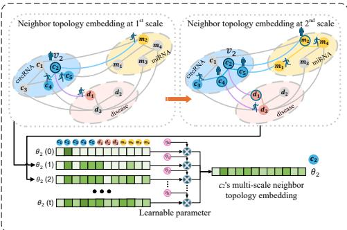

Fig. 3. Process of adaptively constructing multi-scale neighbor topology embeddings with RwR, illustrated by node $c_{2}$  

step, or d-scale neighbors that can be reached in d $(d>1)$ steps. The multi-scale neighbor topological structure formed by these neighboring nodes can provide important auxiliary information for predicting the associations between circRNAs and diseases. The contributions of low-scale (one-scale) neighbors and high-scale (d-scale) neighbors to the features learned for each node are different, thus, we proposed AMNE, which.utilizes random walk with restart (RwR) to establish multiscale neighbor topology embeddings (Figure 3). Taking $v_{i}$ as an example, the walker starts from $v_{i}$  and performs random walks to travel to other nodes in the circRNA-disease-miRNA heterogeneous graph. The probability distribution of reaching all circRNA, disease, and miRNA nodes at time $t\left(1\leqslant t\leqslant r\right)$ is given by $\dot{\theta_{i}^{(0)}}(t)\stackrel{\cdot}{\\in}}\mathbb{R}^{1\times N_{i}}$ U 

$$\theta_{i}^{(0)}(t)=(1-\lambda){O^{(0)}}^{T}\theta_{i}^{(0)}(t-1)+\lambda\theta_{i}^{(0)}(0),$$

where the $j^{-mathrm{t h}}$ value of $\theta_{i}^{(0)}(t)$ denotes the probability that the walker starts from $v_{i}$  reaches node $v_{j}(0\leqslant j<N_{v})$ after t steps.$\theta_{i}^{(0)}(0)$ is the initial one-hot vector, where the i-th position is 1 and all other positions are O.  is the probability that the walker restarts from the starting point; a larger value of X results in a smaller movement range of the walker within the network.$O^{(0)}\in\mathbb{R}^{N_{v}\times N_{v}}$ is obtained from the row-normalized matrix of $G^{(0)}$ in Eq.(6), where $o_{i j}\in O^{(0)}$ represents the transition probability from $v_{i}$ to $v_{j}$ .$\hat{\theta}_{i}^{(0)}(t)$ can be viewed as the probability distribution of reaching various nodes after t steps from $v_{i}$ , thus it serves as the t-scale neighbor topology embedding of $v_{i}$ 

According to Eq. (7), we can build neighbor topology embeddings from scale O to scale r. These scale neighbor topology embeddings are adaptively fused to obtain the multiscale neighbor topology embedding $\theta_{i}^{(0)}$ for $v_{i}$ ,

$$\theta_{i}^{(0)}=\eta_{0}\theta_{i}^{(0)}(0)+\eta_{1}\theta_{i}^{(0)}(1)+\cdots+\eta_{k}\theta_{i}^{(0)}(k)+\cdots+\eta_{r}\theta_{i}^{(0)}(r),$$

where $\eta_{k}\in(0,1)$  are randomly initialized learnable parameters, and $\textstyle\sum_{k=0}^{r}\eta_{k}=1$ 

After applying AMNE for each $v_{i}(0\leqslant i<N_{v})$ !, we can obtain the multi-scale neighbor embedding for all nodes. These embeddings are stacked vertically to form the embedding matrix $R^{(0)}\in\mathbb{R}^{N_{v}\times N_{v}}$ 

$$R^{(0)}=\left[\begin{array}{c}{\theta_{0}^{(0)}}\\ {\theta_{1}^{(0)}}\\ {\vdots}\\ {\theta_{i}^{(0)}}\\ {\vdots}\\ {\theta_{N_{p}-1}^{(0)}}\\ \end{array}\right].$$

### D. Node feature learning based on DMTT

Typically, multiple circRNAs and miRNAs form interactions and collaboratively participate in the processes of various diseases. Therefore, there are close relationships among the features of multiple circRNAs, miRNAs, and disease nodes,making it necessary to establish a self-attention mechanism to capture these relationships. Traditional transformers focus solely on the similarities between node features and do not fully exploit the topological structures formed between nodes,especially the multi-scale neighbor topological structures. Inspired by the transformer proposed by Vaswani et al. [57], we introduce a DMTT (dynamic multi-scale neighbor topologyguided transformer) mechanism (Figure 4) that utilizes the multi-scale neighbor topology embeddings established by AMNE to guide the learning of attention scores..

We use a multi-head attention mechanism to prevent singlehead attention from getting stuck in local optima during training, reducing bias in the learning process. For the mth attention head, we first establish the query matrix $Q_{m}^{(l)}\in$ R $\ N_{v}\times\frac{N_{v}}{h}$ the key matrix $K_{m}^{(l)}\in\mathbb{R}^{N_{v}\dot{\times}\frac{N_{v}}{h}}$ and the value matrix $V_{m}^{(l)}\in\mathbb{R}^{\dot{N_{v}}\times\frac{N_{v}}{h}}$ as follows,

$$\begin{aligned}{Q_{m}^{(l)}}&{{}=G^{(l-1)}W_{m}^{Q(l)}}\\ {K_{m}^{(l)}}&{{}=G^{(l-1)}W_{m}^{K(l)},}\\ {V_{m}^{(l)}}&{{}=G^{(l-1)}W_{m}^{V(l)}}\\ \end{aligned}$$

where $G^{(l-1)}\in\mathbb{R}^{N_{v}\times N_{v}}$ is the feature matrix of the graph nodes that are input at layer l $(1\leqslant l\leqslant L)$ I. When $l=\widetilde{1,G^{(0)}}$ represents the original feature matrix, and h is the number of attention heads..$\widetilde{Q_{m}^{(l)}},K_{m}^{(l)}$ , and $V_{m}^{(l)}$ are obtained from $G^{(l-1)}$ 1through different linear projections, with $W_{m}^{Q(l)},\thinspace W_{m}^{K(l)}$ ', and $W_{m}^{V(\vec{l})}\in\mathbb{R}^{N_{v}\times\frac{N_{v}}{h}}$ being the corresponding weight matrices for the linear projections. Then, we perform a dot product operation on $Q_{m}^{(l)}$ and $K_{m}^{(l)^{T}}$ to obtain the attention score matrix $S_{m}^{(l)}\in\vec{\mathbb{R}}^{N_{v}\times N_{v}}$ 1

$$S_{m}^{(l)}=\frac{Q_{m}^{(l)}{K_{m}^{(l)}}^{T}}{\sqrt{d}},$$

where $\ d\;=\;\textstyle\frac{N_{v}}{h}$ and $\sqrt{d}$ is a scaling factor used to adjust the magnitude of the attention scores to enhance numerical stability during the training process. The i-th row of.$S_{m}^{(l)}$ records the attention scores from all circRNA, disease, and miRNA nodes to $v_{i}$ .

After the (l - 1)th layer of DMTT encoding, the topology  between the nodes is updated. We perform row normalization on feature matrix $G^{(l-1)}$ to obtain the new.$O^{(l-1)}$ ', and apply 